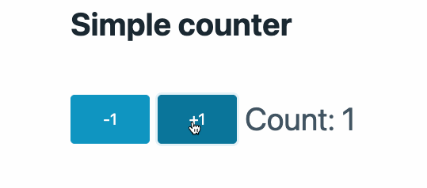

# Livecomponent Anatomy

## What is a Livecomponent?

A Livecomponent is a subclass of the Component class from the [django-components project](https://github.com/django-components/django-components/tree/0.28.3). The main goal of django-components is to provide reusable components for Django templates.

Livecomponents extend these with dynamic rendering capabilities. Unlike basic components, livecomponents can store their own state and provide actions that can be called from the web page.

Here and in some places below, we compare livecomponents with React components. If you are familiar with React, you will notice some similarities.

You can think of a regular component from django-components as a React component that only has props and no state. Its appearance is defined purely in the template that calls it and passes arguments (props) to it. In contrast, a livecomponent is like a React component that has both props and state, and can re-render itself in response to user actions.

!!! note "Compatibility with django-components"

    The version of django-components used with Livecomponents is 0.28.3. Since then, the upstream project has advanced significantly and introduced some breaking changes, but we are still using this version for compatibility reasons.

## Simple Livecomponent

We usually store livecomponents in the `components` directory of the related Django app. For example, for an app called `counters`, we would store the livecomponents in the `counters/components` directory.

Each component is stored in a separate directory, inside which we keep the Python file with the component class and the Django HTML template, like this:

```
counters/
    components/
        simplecounter/
            simplecounter.py
            simplecounter.html
```

Instead of creating the directory structure manually, you can use the `createlivecomponent` management command. This command will create the files with boilerplate code and provide brief instructions on how to use them.

For example:

```bash
./manage.py createlivecomponent counters simplecounter

Created component files: ...
- If necessary, add 'counters.components.simplecounter.simplecounter' to COMPONENTS['libraries'] in your settings
- Use component as 
- If the component is called from a parent component, use it as 
```

Assuming the Django project is correctly configured, the component can be inserted on any page with the following syntax:

```django


```

For example (with no arguments):

```django


```

The livecomponent Python classes are defined in the `simplecounter.py` file. There are usually two classes: the component class and the state class.

- The component class is a subclass of the `LiveComponent` class.
- The state class is a subclass of the `BaseModel` class from the `pydantic` library.

## Component Python Class

Here's the Python class for the simplecounter component.

As you can see, there are two classes: the state class and the component class.
The state keeps the counter value, and the component class defines two commands: `increment` and `decrement`.

```python
from django_components import component

from livecomponents import (
    LiveComponent,
    LiveComponentsModel,
    command,
)


class SimplecounterState(LiveComponentsModel):
    count: int = 0


@component.register("simplecounter")
class SimplecounterComponent(LiveComponent[SimplecounterState]):
    template_name = "simplecounter/simplecounter.html"

    def init_state(self, context):
        return SimplecounterState()

    @command
    def increment(self, call_context):
        """Example command."""
        call_context.state.count += 1

    @command
    def decrement(self, call_context):
        """Example command."""
        call_context.state.count -= 1
```

## Component Template

The template is defined in the `simplecounter.html` file.

```html


<div >
  <button hx-post="">-1</button>
  <button hx-post="">+1</button>
  <div>Count: {{ count }}</div>
</div>
```

The important points here are:

- The component must be wrapped with an HTML element (a top-level div in this case).
- The top-level div must contain the "magic" template tag ``. This tag expands to a set of livecomponent-specific and HTMX-specific attributes that are used to correctly address the element when re-rendering it in response to commands.
- Actions are defined as HTMX-style POST requests.

The result will look like this:



## Component Commands

The `` template tag expands to a URL that looks like this: `/livecomponents/call_command/?session_id=<session>&component_id=<component_id>&command_name=<command_name>`.

On the server side, the command is called by the livecomponent handler, which finds the component class, fetches the state from the store, and calls the command handler. Then the command handler redraws the component and returns the result to the client.

## Component State

The state is defined in a separate class. The state must include parameters passed to the component as keyword arguments, so that the component gets all the necessary information to re-render itself on partial render.

For example, given the template for the alert component:

```html
<alert>{{ message }}</alert>
```

that you want to use as

```html

```

Assuming that the component will be re-rendered on partial render, the state must include the "message" parameter:

```python
from pydantic import BaseModel
from livecomponents.component import LiveComponent
from livecomponents.manager.manager import InitStateContext

class AlertState(BaseModel):
    message: str = ""


class Alert(LiveComponent):

    template_name = "alert.html"

    def init_state(self, context: InitStateContext) -> AlertState:
        return AlertState(**context.component_kwargs)
```

Component states don't need to be stored if components are not expected to be re-rendered independently, and only as part of the parent component. For example, components for buttons are rarely re-rendered independently, so you can get away without the state model.

## Serializing Component State

When the page is rendered for the first time, a new session is created, and each component is initialized with its state by calling the `init_state()` method.

The state is then serialized and stored in the session store, and as long as the session is the same (in other words, while the page is not reloaded), the state is reused.

The state is serialized using the `StateSerializer` class and saved in Redis. By default, the `PickleStateSerializer` is used. The serializer uses a custom pickler and is optimized to effectively store the most common types of data used in a Django app. More specifically:

- When serializing a Django model, only the model's name and primary key are stored. The serializer takes advantage of the persistent_id/persistent_load pickle mechanism.
- When serializing a Pydantic model, only the model's name and the values of the fields are stored.
- When serializing a Django form, only the form's class name, as well as initial data and data, are stored.

!!! note "Session Storage Size Warning"

    Livecomponents use Redis as the session store. Remember that a new session is created for each page load of every client, and stored there for 24 hours by default. This means you should keep the state small.

## Stateless components

If the component doesn't store any state, you can inherit from the StatelessLiveComponent class. You may find this helpful for rendering a hierarchy of components where the shared state is stored in the root components.

```python
from livecomponents.component import StatelessLiveComponent

class StatelessAlert(StatelessLiveComponent):

    template_name = "alert.html"

    def get_extra_context_data(
        self, extra_context_request: "ExtraContextRequest[State]"
    ) -> dict:
        state_manager = extra_context_request.state_manager
        root_addr = extra_context_request.state_addr.must_find_ancestor("root")
        root_state = state_manager.get_component_state(root_addr)
        return {"message": root_state.message}
```

## Returning results from command handlers

Here's the signature of a Livecomponent function:

```python
from livecomponents import LiveComponent, CallContext, command
from livecomponents.manager.execution_results import IExecutionResult

class MyComponent(LiveComponent):

    @command
    def my_command_handler(self, call_context: CallContext, **kwargs) -> list[IExecutionResult] | IExecutionResult | None:
        ...
```

Notice the return type for the handler. If set to something other than None, it can shape the partial HTTP response.

More specifically, here's what you can do:

- Return ComponentDirty() to mark the component as dirty. This will result in the component being re-rendered and sent to the client. This is the default behavior. If you don't return anything, the component will be marked as dirty.
- Return ComponentDirty(component_id) to mark a different component as dirty.
- Return ComponentClean() to mark the current component as clean (not needing re-rendering).
- Return ParentDirty() to mark the parent component as dirty.
- Return RefreshPage(). If the command returns RefreshPage(), a "HX-Refresh: true" header will be sent to the client.
- Return RedirectPage(url). If the command returns Redirect(), a "HX-Redirect: url" header will be sent to the client.
- Return ReplaceUrl(url). If the command returns ReplaceUrl(), a "HX-Replace: url" header will be sent to the client. This will replace the current URL in the browser without reloading the page.

## Raising exceptions from command handlers

In some rare scenarios, you may need to cancel rendering the component and instruct the command handler to return an empty string to the client.

If this is the case, you can raise a `livecomponents.exceptions.CancelRendering()` exception.

The exception can be raised directly from a command handler or from one of the methods that it calls, such as `get_extra_context_data()`.

```python
from livecomponents.exceptions import CancelRendering
...

class MyComponent(LiveComponent):

    @command
    def my_command_handler(self, call_context: CallContext, **kwargs):
        if not self.pre_condition_met(call_context):
            raise CancelRendering()
        ...
```

We encountered this situation at least once, where a race condition caused the pre-condition that was true when we started executing a command to no longer be true when we rendered a sub-component. In this case, we couldn't render the sub-component but also didn't want to return a partially rendered component. The best solution was to return an empty string, effectively making the command have no effect.

## Calling component methods from others

There are several ways to call component methods from other components:

**Using the component ID.** For example, if you have a component with ID "|message.0" and a method "set_message", you can call it like this:

```python
from livecomponents import LiveComponent, command, CallContext

class MyComponent(LiveComponent):

    @command
    def do_something(self, call_context: CallContext):
        call_context.find_one("|message:0").set_message("Hello, world!")
```

**Using the "parent" reference.**

```python
from livecomponents import LiveComponent, command, CallContext

class MyComponent(LiveComponent):

    @command
    def do_something(self, call_context: CallContext):
        call_context.parent.set_message("Hello, world!")
```
