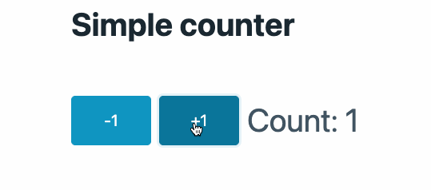

# Livecomponent Anatomy

## What is a Livecomponent?

A Livecomponent is a subclass of the Component class from the [django-components project](https://github.com/django-components/django-components/tree/0.28.3). The main goal of django-components is to provide reusable components for Django templates.

Livecomponents extend these with dynamic rendering capabilities. Unlike basic components, livecomponents can store their own state and provide actions that can be called from the web page.

Here and in some places below, we compare livecomponents with React components. If you are familiar with React, you will notice some similarities.

You can think of a regular component from django-components as a React component that only has props and no state. Its appearance is defined purely in the template that calls it and passes arguments (props) to it. In contrast, a livecomponent is like a React component that has both props and state, and can re-render itself in response to user actions.

!!! note "Compatibility with django-components"

    The version of django-components used with Livecomponents is 0.28.3. Since then, the upstream project has advanced significantly and introduced some breaking changes, but we are still using this version for compatibility reasons.

## Simple Livecomponent

We usually store livecomponents in the `components` directory of the related Django app. For example, for an app called `counters`, we would store the livecomponents in the `counters/components` directory.

Each component is stored in a separate directory, inside which we keep the Python file with the component class and the Django HTML template, like this:

```
counters/
    components/
        simplecounter/
            simplecounter.py
            simplecounter.html
```

Instead of creating the directory structure manually, you can use the `createlivecomponent` management command. This command will create the files with boilerplate code and provide brief instructions on how to use them.

For example:

```bash
./manage.py createlivecomponent counters simplecounter

Created component files: ...
- If necessary, add 'counters.components.simplecounter.simplecounter' to COMPONENTS['libraries'] in your settings
- Use component as 
- If the component is called from a parent component, use it as 
```

Assuming the Django project is correctly configured, the component can be inserted on any page with the following syntax:

```django


```

For example (with no arguments):

```django


```

The livecomponent Python classes are defined in the `simplecounter.py` file. There are usually two classes: the component class and the state class.

- The component class is a subclass of the `LiveComponent` class.
- The state class is a subclass of the `BaseModel` class from the `pydantic` library.

!!! note "LiveComponentsModel vs BaseModel"

    You can use either `pydantic.BaseModel` or `livecomponents.LiveComponentsModel` for your state class. `LiveComponentsModel` is a `BaseModel` subclass that sets `arbitrary_types_allowed=True`. Use it when your state holds Django forms, model instances, or other types that Pydantic cannot validate on its own. If your state contains only primitive types and Pydantic models, plain `BaseModel` works fine.

## Component Python Class

Here's the Python class for the simplecounter component.

As you can see, there are two classes: the state class and the component class.
The state keeps the counter value, and the component class defines two commands: `increment` and `decrement`.

```python
from django_components import component

from livecomponents import (
    LiveComponent,
    LiveComponentsModel,
    command,
)


class SimplecounterState(LiveComponentsModel):
    count: int = 0


@component.register("simplecounter")
class SimplecounterComponent(LiveComponent[SimplecounterState]):
    template_name = "simplecounter/simplecounter.html"

    def init_state(self, context):
        return SimplecounterState()

    @command
    def increment(self, call_context):
        """Example command."""
        call_context.state.count += 1

    @command
    def decrement(self, call_context):
        """Example command."""
        call_context.state.count -= 1
```

## Component Template

The template is defined in the `simplecounter.html` file.

```html


<div >
  <button hx-post="">-1</button>
  <button hx-post="">+1</button>
  <div>Count: {{ count }}</div>
</div>
```

The important points here are:

- The component must be wrapped with an HTML element (a top-level div in this case).
- The top-level div must contain the "magic" template tag ``. This tag expands to a set of livecomponent-specific and HTMX-specific attributes that are used to correctly address the element when re-rendering it in response to commands.
- Actions are defined as HTMX-style POST requests.

The result will look like this:



## Component Commands

The `` template tag expands to a URL that looks like this: `/livecomponents/call_command/?session_id=<session>&component_id=<component_id>&command_name=<command_name>`.

On the server side, the command is called by the livecomponent handler, which finds the component class, fetches the state from the store, and calls the command handler. Then the command handler redraws the component and returns the result to the client.

## Request Lifecycle

A full interaction cycle has two phases: initial page load and command execution.

Every rendered component has its own state stored in Redis. The state's address has two coordinates: a **session ID** and a **component ID**. The `` tag in the base template generates a fresh session ID on each page load. The component ID is built deterministically from the component's type, its own ID, and its parent chain. Each segment is `type:own_id` — for example, `|table:0|row:3` means a `row` component with own ID `3` inside a `table` component with own ID `0`. The own ID defaults to `0`; when you place multiple components of the same type at the same level, pass a distinct `own_id` to each (e.g., ``). Together, the session ID and the full component ID form a `StateAddress` — the key the library uses to store and retrieve that component's state.

**Page load:**

1. The browser requests a page. Django renders the template, which contains `` tags.
2. For each component, the library calls `init_state()` to create the initial state, serializes it with Pickle, and stores it in Redis under the component's `StateAddress`.
3. The component template renders with the state fields as context variables. The root element gets HTMX attributes (`hx-swap-oob`, `data-livecomponent-id`, `key`) via ``.

**Command execution:**

1. The user clicks a button (or triggers another HTMX event). HTMX sends a POST to `/livecomponents/call_command/` with the session ID, component ID, and command name.
2. The `call_command` view loads the component's state from Redis and deserializes it.
3. The `@command` method runs, receiving a `CallContext` with the current state. The method modifies the state as needed and returns execution results (or `None` for default behavior).
4. The library saves the updated state to Redis, re-renders the component template, and returns the HTML.
5. HTMX swaps the new HTML into the DOM.

If the session has expired (e.g., the Redis key's 24-hour TTL elapsed), the view returns HTTP 410 Gone.

## Component State

The state is defined in a separate class. The state must include parameters passed to the component as keyword arguments, so that the component gets all the necessary information to re-render itself on partial render.

For example, given the template for the alert component:

```html
<alert>{{ message }}</alert>
```

that you want to use as

```html

```

Assuming that the component will be re-rendered on partial render, the state must include the "message" parameter:

```python
from pydantic import BaseModel
from livecomponents.component import LiveComponent
from livecomponents.manager.manager import InitStateContext

class AlertState(BaseModel):
    message: str = ""


class Alert(LiveComponent):

    template_name = "alert.html"

    def init_state(self, context: InitStateContext) -> AlertState:
        return AlertState(**context.component_kwargs)
```

Components that only re-render as part of their parent can skip state entirely. Inherit from `StatelessLiveComponent` instead (see [Stateless components](#stateless-components) below). A button that calls a command on its parent is a typical example.

::: livecomponents.manager.manager.InitStateContext
    options:
      heading_level: 3
      show_root_heading: true
      members: false

::: livecomponents.manager.manager.UpdateStateContext
    options:
      heading_level: 3
      show_root_heading: true
      members: false

::: livecomponents.component.ExtraContextRequest
    options:
      heading_level: 3
      show_root_heading: true
      members: false

## Serializing Component State

As described in [Request Lifecycle](#request-lifecycle), the state is serialized and stored in Redis on the first render, then reused for the lifetime of the session (until the page is reloaded or the TTL expires).

By default, the `PickleStateSerializer` is used. The serializer uses a custom pickler and is optimized to effectively store the most common types of data used in a Django app. More specifically:

- When serializing a Django model, only the model's name and primary key are stored. The serializer takes advantage of the persistent_id/persistent_load pickle mechanism.
- When serializing a Pydantic model, only the model's name and the values of the fields are stored.
- When serializing a Django form, only the form's class name, as well as initial data and data, are stored.

!!! note "Session Storage Size Warning"

    Livecomponents use Redis as the session store. Remember that a new session is created for each page load of every client, and stored there for 24 hours by default. This means you should keep the state small.

## Stateless components

If the component doesn't store any state in livecomponents, you can inherit from the `StatelessLiveComponent` class. This is useful in two scenarios:

**1. Child components that read a parent's state:**

```python
from livecomponents.component import StatelessLiveComponent

class StatelessAlert(StatelessLiveComponent):

    template_name = "alert.html"

    def get_extra_context_data(
        self, extra_context_request: "ExtraContextRequest[State]"
    ) -> dict:
        state_manager = extra_context_request.state_manager
        root_addr = extra_context_request.state_addr.must_find_ancestor("root")
        root_state = state_manager.get_component_state(root_addr)
        return {"message": root_state.message}
```

**2. Components that manage state externally** (e.g. in a database, a file, or any other storage):

```python
from livecomponents import CallContext, StatelessLiveComponent, command
from livecomponents.component import ExtraContextRequest, StatelessModel
from livecomponents.manager.execution_results import ComponentDirty

from myapp.models import Counter

class ExternalCounter(StatelessLiveComponent):

    template_name = "external_counter.html"

    def get_extra_context_data(
        self, extra_context_request: ExtraContextRequest[StatelessModel]
    ) -> dict:
        return {"count": Counter.objects.get_value()}

    @command
    def increment(self, call_context: CallContext):
        Counter.objects.increment()
        return ComponentDirty()
```

Stateless components can have their own commands — they don't need a parent component to function. They work standalone on a page just like regular stateful components.

## Returning results from command handlers

Command handlers can return execution results to control component rendering and browser behavior. Here's the basic signature:

```python
from livecomponents import LiveComponent, CallContext, command
from livecomponents.manager.execution_results import IExecutionResult

class MyComponent(LiveComponent):

    @command
    def my_command_handler(self, call_context: CallContext, **kwargs) -> list[IExecutionResult] | IExecutionResult | None:
        ...
```

If a command handler returns `None` (or doesn't return anything), the component is automatically marked as dirty and will be re-rendered.

For detailed information about all available execution results and their usage, see the [Execution Results reference](execution_results.md).

## Raising exceptions from command handlers

In some rare scenarios, you may need to cancel rendering the component and instruct the command handler to return an empty string to the client.

If this is the case, you can raise a `livecomponents.exceptions.CancelRendering()` exception.

The exception can be raised directly from a command handler or from one of the methods that it calls, such as `get_extra_context_data()`.

```python
from livecomponents.exceptions import CancelRendering
...

class MyComponent(LiveComponent):

    @command
    def my_command_handler(self, call_context: CallContext, **kwargs):
        if not self.pre_condition_met(call_context):
            raise CancelRendering()
        ...
```

We encountered this situation at least once, where a race condition caused the pre-condition that was true when we started executing a command to no longer be true when we rendered a sub-component. In this case, we couldn't render the sub-component but also didn't want to return a partially rendered component. The best solution was to return an empty string, effectively making the command have no effect.

## Calling component methods from others

There are several ways to call component methods from other components:

**Using the component ID.** For example, if you have a component with ID "|message:0" and a method "set_message", you can call it like this:

```python
from livecomponents import LiveComponent, command, CallContext
from livecomponents.const import HIER_SEP, TYPE_SEP

class MyComponent(LiveComponent):

    @command
    def do_something(self, call_context: CallContext):
        call_context.find_one(f"{HIER_SEP}message{TYPE_SEP}0").set_message("Hello, world!")
```

**Using the "parent" reference.**

```python
from livecomponents import LiveComponent, command, CallContext

class MyComponent(LiveComponent):

    @command
    def do_something(self, call_context: CallContext):
        call_context.parent.set_message("Hello, world!")
```

::: livecomponents.manager.manager.CallContext
    options:
      heading_level: 2
      show_root_heading: true

::: livecomponents.manager.manager.StateManager
    options:
      heading_level: 2
      show_root_heading: true
      members:
        - get_component_state
        - set_component_state
